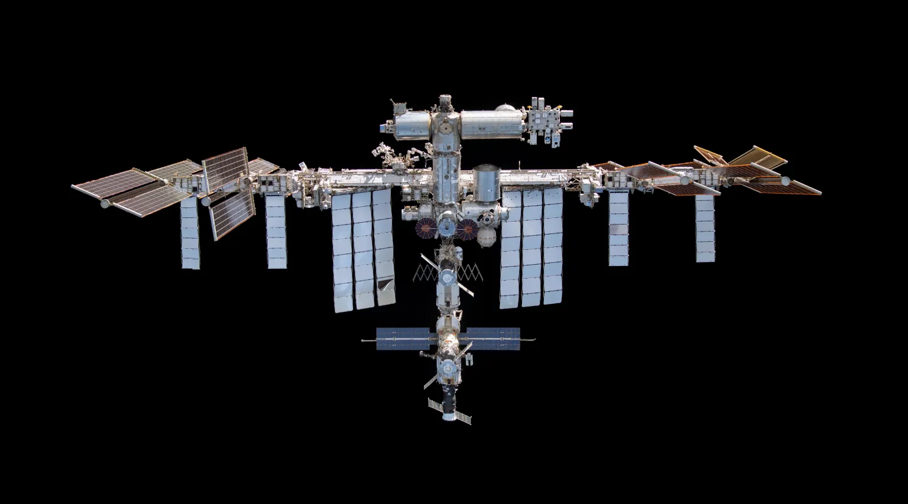
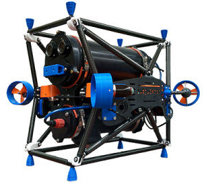
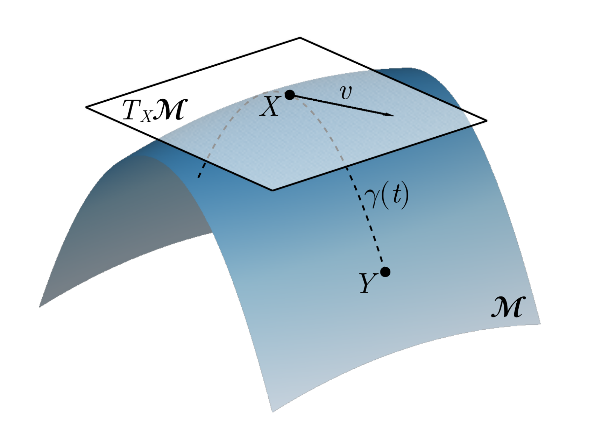
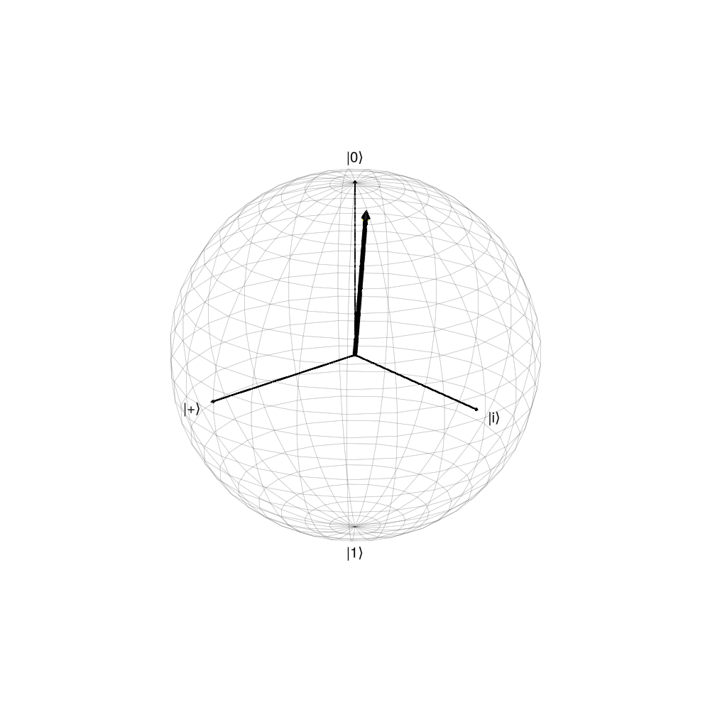
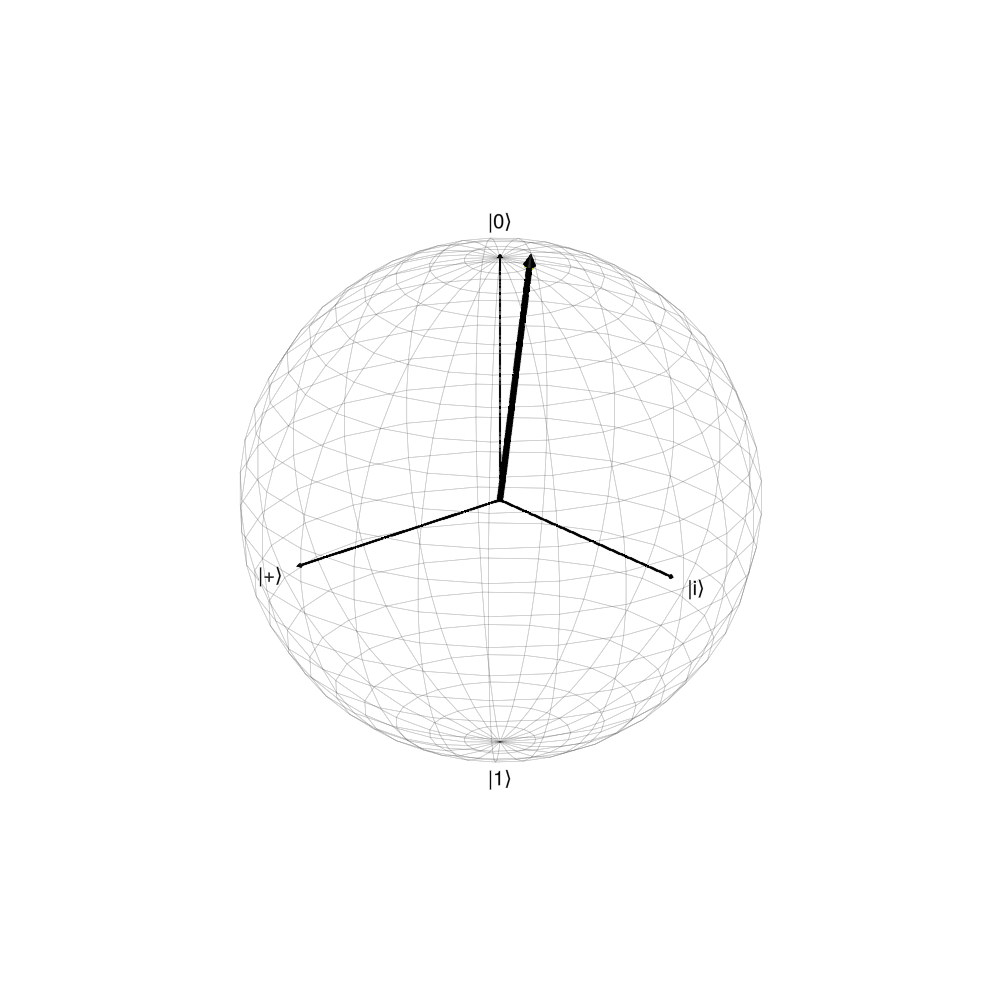
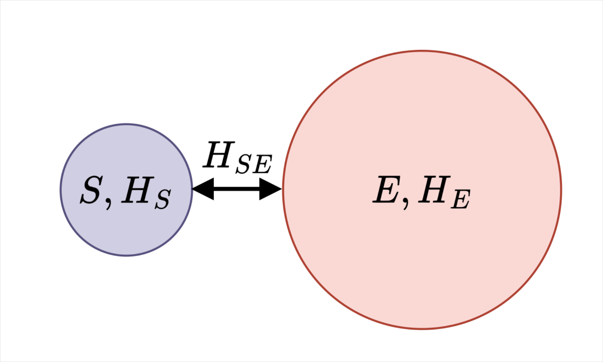
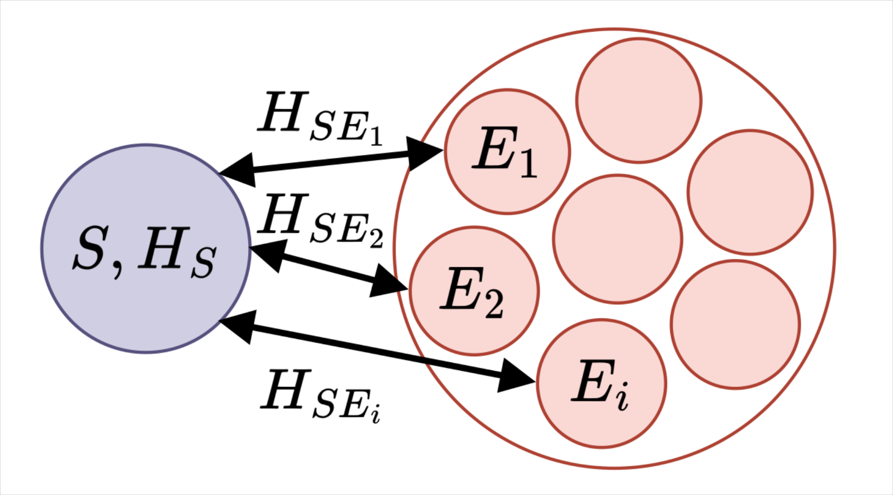
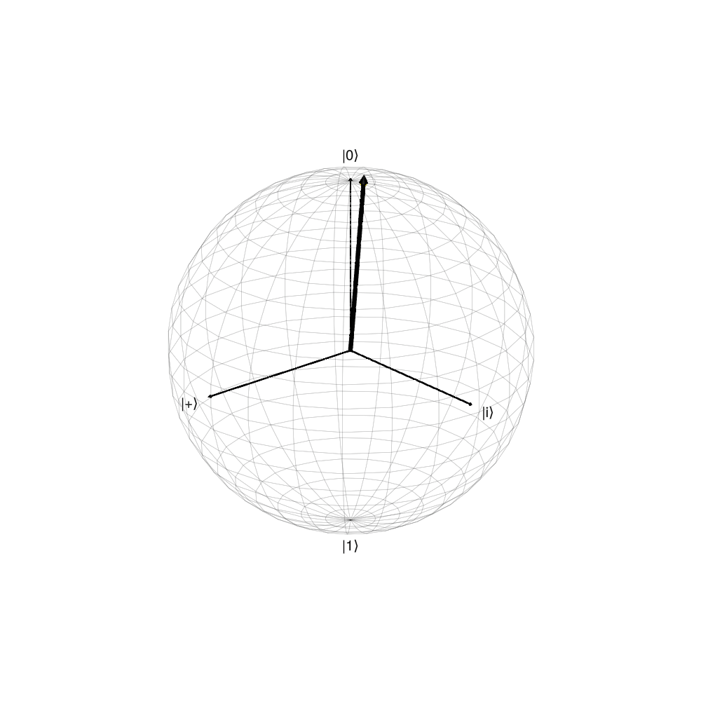

# Introduction to Quantum Noise

## Outline
1. What is classical noise?
   - 3D Rotations
2. What is quantum noise?
   - Single qubit
3. Open Quantum Systems

# Classical

## 3D Rotations

- Wish to rotate a rigid body

{width=300px}

<!-- ## Rotating a submarine

- Thrusters provide a force, inducing torque and angular acceleration
    $$\mathbf{\tau} = \mathbf{r} \times \mathbf{F} = \mathbf{I} \mathbf{\alpha}$$
- Angular velocity
  $$\Delta\mathbf{\omega} = \int \mathbf{\alpha}dt \approx \mathbf{\alpha} \Delta t \quad (\mathbf{\alpha} = \mathrm{constant}) $$
- Angular position
  $$\Delta\mathbf{\theta} = \mathbf{\omega_0} \Delta t + \frac{1}{2}\mathbf{\alpha}(\Delta t)^2$$ -->

## Rotating a submarine

## 3D Rotations: Matrices

- Space of all orthogonal matrices $R^T R = I$ with $\det(R) = 1$.

- R rotates a vector $\vec{x}$
$$\vec{x}^\prime = R\vec{x}$$

- Random $R$:
$$R = \begin{pmatrix}
  0.737057  & 0.0728603 & -0.671892\\
 -0.673864  & 0.155032  & -0.722408\\
  0.0515299 & 0.985219  &  0.163365
\end{pmatrix}$$

## 3D Rotations: Matrices

$R = R_z(a)R_y(b)R_x(c)$

$$
  R_x(\theta) = \begin{pmatrix}
1 & 0 & 0 \\
0 & \cos(\theta) & -\sin(\theta) \\
0 & \sin(\theta) & \cos(\theta)
\end{pmatrix}
$$

$$
R_y(\theta) = \begin{pmatrix}
\cos(\theta) & 0 & \sin(\theta) \\
0 & 1 & 0 \\
-\sin(\theta) & 0 & \cos(\theta)
\end{pmatrix}
$$

$$
R_z(\theta) = \begin{pmatrix}
\cos(\theta) & -\sin(\theta) & 0 \\
\sin(\theta) & \cos(\theta) & 0 \\
0 & 0 & 1
\end{pmatrix}
$$

## Angular Velocity

- Rotating along an axis with some angular speed

## Angular Velocity: Matrices

- The angular velocities are skew-symmetric matrices $\Omega^T = -\Omega$

$$\Omega = \dot{R} = \begin{pmatrix} 
0 & -\omega_z & \omega_y \\
\omega_z & 0 & -\omega_x \\
-\omega_y & \omega_x & 0 
\end{pmatrix}$$

where $\omega = (\omega_x, \omega_y, \omega_z)$ is the angular velocity vector

- Recall $R(t)^TR(t) = I$, then $\dot{R}^TR + R^T\dot{R} = 0$ and hence
$$\dot{R}^T = -\dot{R}$$ 

<!-- - $\omega = (v_x \theta, v_y\theta, v_z\theta)$ where $v$ is axis and $\theta$ is a   -->

## Evolution of Rotations

- Solve the differential equation $\frac{dR}{dt} = \mathbf{\Omega} R(t)$
- Solution is given by the exponential
$$R(t) = \exp(\Omega t) = \mathbf{I} + (\sin t) \mathbf{\Omega} + (1 - \cos t) \mathbf{\Omega}^2$$

## The world of Differential Geometry

{width=400px}

- $\mathcal{M}$ is the space of rotation matrices ($R$)
- $T_x\mathcal{M}$ is the derivative (tangent) of a rotation ($\Omega$)
- Tangent space is a vector space (axis of rotation)
- "Integration" -- $\exp(\Omega t) : T_x\mathcal{M} \mapsto \mathcal{M}$
- "Derivative" -- $\log(M) : \mathcal{M} \mapsto T_x\mathcal{M}$

Read more: $SO(3)$ and $\mathfrak{so}(3)$ (Lie Group and Lie Algebra)

## Noise

1. Uncertainty in your current state (rotation)
    - $90\% \rightarrow R_0$
    - $10\% \rightarrow R_1$
2. An external "push" that changes your angular velocity
    - $\Omega + \epsilon \Omega_\epsilon$
    - "push" can also have uncertainty

## State uncertainty

{width=400px}
{width=400px}

## External perturbations

{width=400px}
{width=400px}

## External perturbations

{width=400px}

## Summary

1. Want to achieve a rotation
2. Space of all rotations are orthogonal matrices
3. The derivatives of rotations are skew-symmetric matrices (tangent space)
4. The $\exp$ and $\log$ map between rotation space and tangent space 
5. Examples of noise
   - State uncertainty
   - Deviations in tangent space

# Quantum

## Qubit(s) Rotation

{width=300px}
{width=300px}

Image Credits: HRL Labs (left) and LLNL (right)

## Controlling a qubit

## Quantum Evolution: Matrices

- Space of all unitary matrices $U^\dagger U = I$
- $U$ evolves a quantum state $\ket{\psi}$
  $$\ket{\psi^\prime} = U\ket{\psi}$$
- Random $U$:
  $$U = \begin{pmatrix} -0.173944-0.184276i &  -0.0800533+0.964042i \\
  0.876815+0.408633i &  0.0737403+0.242439i\end{pmatrix}$$

## Quantum Evolution: Matrices

- $U = \vec{q} \cdot \vec{\sigma}$
- $\vec{q} = (\sin\theta \cos\phi, \sin\theta\sin\phi, \cos\theta)$
- $\vec{\sigma} = (\sigma_x, \sigma_y, \sigma_z)$ -- vector of Pauli matrices

$$ U = \begin{pmatrix} \cos \theta & e^{-i\phi}\sin\theta \\ e^{i\phi}\sin\theta & -\cos\theta\end{pmatrix}$$

## Hamiltonian

## Hamiltonian

- Hamiltonians are Hermitian matrices, $H^\dagger = H$
- $H = H_d + \sum_i \alpha_i H_{i}$
  - Drift term: $H_d$
  - Control terms: $H_i$
  - Pulse: $\alpha_i$
- Transmon:
  $$H_d = \begin{pmatrix} 0 & 0 & 0 \\ 0 & 0 & 0 \\ 0 & 0 & -1 \end{pmatrix}, \; H_1 = \begin{pmatrix} 0 & 1 & 0 \\ 1 & 0 & \sqrt{2} \\ 0 & \sqrt{2} & 0 \end{pmatrix},$$
  $$H_2 = \begin{pmatrix} 0 & -i & 0 \\ i & 0 & -i\sqrt{2} \\ 0 & i\sqrt{2} & 0 \end{pmatrix} $$

## Evolution of Unitary Matrices

- Solve the differential (Schrödinger) equation:
  $$i \frac{d}{dt}U(t) = H U(t)$$
- Solution is given by the exponential:
  $$U(t) = \exp(-iHt)$$

## The world of Differential Geometry

{width=400px}

- $\mathcal{M}$ is the space of unitary matrices ($U$)
- $T_x\mathcal{M}$ is the derivative (Hamiltonian, $H$) of a unitary 
- Tangent space is a vector space (we can add Hamiltonians)
- "Integration" -- $\exp(Ht) : T_x\mathcal{M} \mapsto \mathcal{M}$
- "Derivative" -- $\log(U) : \mathcal{M} \mapsto T_x\mathcal{M}$

Read More: $SU(n)$ or $U(n)$ and $\mathfrak{su}(n)$ or $\mathfrak{u}(n)$

## Noise

1. Uncertainty in your current state
    - $90\% \rightarrow \ket{\psi_0}$
    - $10\% \rightarrow \ket{\psi_1}$
2. An external "push" that changes your Hamiltonian
    - $H + \epsilon H_\epsilon$
    - "push" can also have uncertainty

## State Uncertainty

{width=350px}
{width=350px}

## State Uncertainty

{width=400px}

- Density matrix includes both classical and quantum uncertainties
- $\rho = 0.9\ket{\psi_0}\bra{\psi_0} + 0.1\ket{\psi_1}\bra{\psi_1}$
- $\rho^\prime = U\rho U^\dagger$

## Perturbations

{width=350px}
{width=350px}

## Perturbations
{width=400px}

## Summary

1. Want to achieve a quantum gate (a unitary)
2. Space of all gates are unitary matrices
3. The generators of unitary matrices are Hamiltonians (tangent space)
4. The $\exp$ and $\log$ map between unitary space and tangent space 
5. Examples of noise
   - State uncertainty
   - Deviations in tangent space (Hamiltonians)

# Open Quantum Systems

## Microscopic Model

{width=400px}

$$H = H_S + H_E + H_{SE}$$
$$\ket{\psi} = \ket{\psi_S} \otimes \ket{\psi_E}$$

## Collision Model

{width=400px}

$$H = H_S + \sum_i (H_{E_i} + H_{SE_i})$$

- Tiny environmental qubits "collide" with our system and carry away information

## Perturbations from Environment

- Our system entangles with an environment
- Observations of the environment (measurement) induce a backaction on our system
- In the space of our system:
  - no longer a unitary evolution
  - introduction of uncertainty

## Decoherence

- Information leaves our systems
- Maximally mixed state, $\rho_\textrm{mixed} \propto I$

## Quantum Channels

$$\rho_S^\prime = \mathcal{E}(\rho_S)$$

- Describes all physical processes of an open quantum system
- No longer reversible, unless we have access to environment $E$

## Markovian vs Non-Markovian

- In general, $\mathcal{E}(\rho)$ depends on a history of states (non-Markovian)
  - The environment has "memory"
  - Effects such as re-coherence
- In many cases, the assumption is that the environment's state does not change (Markovian)
  - $\mathcal{E}(\rho)$ does not depend on a history
  - The environment has no memory

## Summary

- State uncertainty
- Perturbations in our system Hamiltonian (e.g. bad pulse)
- Entanglement with an environment
  - Decoherence, Re-coherence, etc
- Quantum channels $\mathcal{E}$ capture all physical processes
